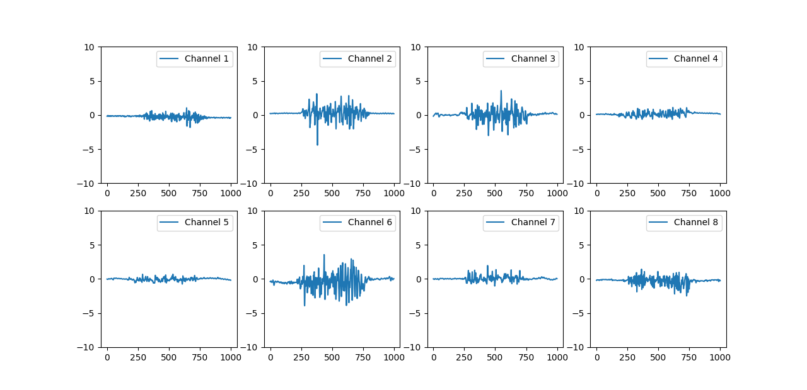

# EMG Live Plotting
This is a script for live visualization of EMG data in Python. It is to be used together with this multichannel EMG sensor: [Multichannel EMG Sensor](./../../../../emg-sensor_board)  

This script visualizes 8 channels simultaneously, and can easily be extended to more channels.

## Getting Started
To run a live visualization, perform the following steps:
1. Connect the Multichannel EMG over USB to the PC
2. Start the live script

## Trouble Shooting
These are known issues and solutions:
1. The script worked, but stopt operating: This happens if the EMG sensor was reset. Restart the script.
2. The USB port is incorrect: Every once in a while the USB port under which the system operates changes. Find the correct port using the device manager and update it in the source code of the script.

## License
For open source projects, say how it is licensed.

## Project status

